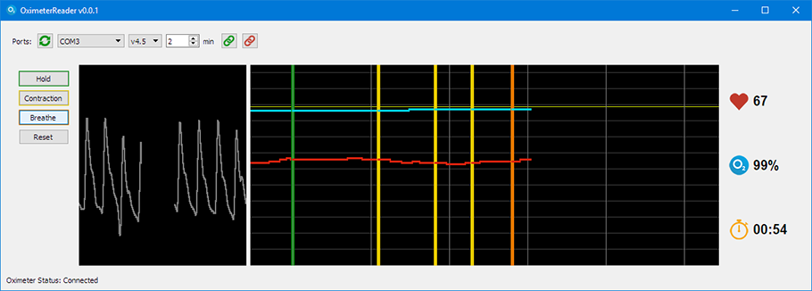

# oximeterReader



OximeterReader is a UI to monitor and visualize data of Pulse Oximeters
It currently supports Contec CMS50D+ with firmware 4.5 and 4.6

OximeterReader in under the [BSD 2-Clause "Simplified" License](LICENSE.txt).

###
## Prerequisite
- Python 3.6
- PySerial
- PyQt5
- [Qt.py](https://github.com/mottosso/Qt.py) (included)

###
## Install
Once Python 3.6 is installed, you can install PySerial and PyQt5 the following way:
```python
python -m pip install PySerial
```
```python
python -m pip install PyQt5
```

###
## Launch
OximeterReader can be launched the following way:
```python
py main.py
```

###
## Config
Some configuration parameters can be changed in the [config.py](config.py) file

###
## Known Issues
- Some secondary parameters are not parsed properly within the v4.6 firmware
